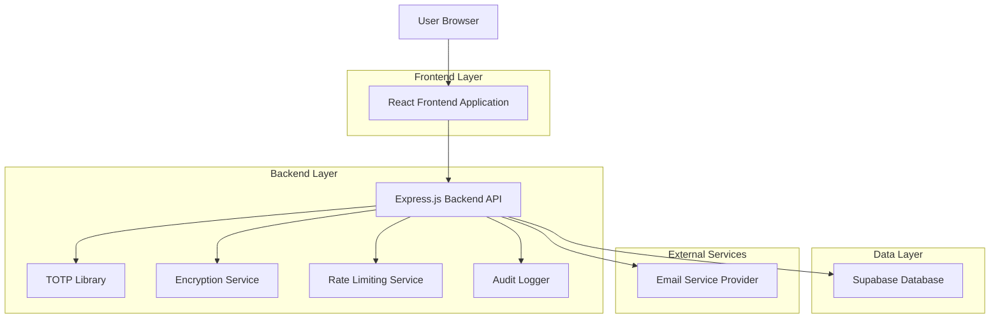

# Multi-Factor Authentication (MFA) System - Technical Architecture Document

## 1. Architecture Design



## 2. Technology Description

- Frontend: React@18 + TypeScript + TailwindCSS@3 + Vite
- Backend: Express@4 + TypeScript + Node.js
- Database: Supabase (PostgreSQL)
- Authentication: Supabase Auth + Custom MFA Layer
- TOTP: speakeasy@2.0.0 + qrcode@1.5.3
- Encryption: crypto (Node.js built-in) + bcrypt@5.1.0
- Email: nodemailer@6.9.0 + SMTP provider
- Rate Limiting: express-rate-limit@6.7.0
- Validation: zod@3.22.0

## 3. Route Definitions

| Route | Purpose |
|-------|---------|
| /mfa/setup | MFA setup wizard page |
| /mfa/verify | MFA verification during login |
| /mfa/email-setup | Email verification setup |
| /mfa/totp-setup | TOTP authenticator setup |
| /security/settings | MFA management and security settings |
| /security/recovery | Recovery code management |
| /dashboard | Main dashboard with MFA suggestion cards |

## 4. API Definitions

### 4.1 Core MFA APIs

**Email Verification Setup**
```
POST /api/mfa/email/setup
```

Request:
| Param Name | Param Type | isRequired | Description |
|------------|------------|------------|-------------|
| email | string | true | User's email address |
| action | string | true | 'setup' or 'verify' |

Response:
| Param Name | Param Type | Description |
|------------|------------|-------------|
| success | boolean | Operation status |
| message | string | Status message |
| expiresAt | string | Code expiration timestamp |

**Email Code Verification**
```
POST /api/mfa/email/verify
```

Request:
| Param Name | Param Type | isRequired | Description |
|------------|------------|------------|-------------|
| code | string | true | 6-digit verification code |
| email | string | true | User's email address |

Response:
| Param Name | Param Type | Description |
|------------|------------|-------------|
| success | boolean | Verification status |
| token | string | MFA verification token |
| attemptsRemaining | number | Remaining attempts |

**TOTP Setup**
```
POST /api/mfa/totp/setup
```

Request:
| Param Name | Param Type | isRequired | Description |
|------------|------------|------------|-------------|
| userId | string | true | User identifier |

Response:
| Param Name | Param Type | Description |
|------------|------------|-------------|
| secret | string | Base32 encoded secret |
| qrCodeUrl | string | QR code data URL |
| backupCodes | string[] | Recovery codes |

**TOTP Verification**
```
POST /api/mfa/totp/verify
```

Request:
| Param Name | Param Type | isRequired | Description |
|------------|------------|------------|-------------|
| code | string | true | 6-digit TOTP code |
| userId | string | true | User identifier |

Response:
| Param Name | Param Type | Description |
|------------|------------|-------------|
| success | boolean | Verification status |
| token | string | MFA verification token |
| timeWindow | number | Current time window |

**Recovery Code Usage**
```
POST /api/mfa/recovery/verify
```

Request:
| Param Name | Param Type | isRequired | Description |
|------------|------------|------------|-------------|
| recoveryCode | string | true | Single-use recovery code |
| userId | string | true | User identifier |

Response:
| Param Name | Param Type | Description |
|------------|------------|-------------|
| success | boolean | Verification status |
| remainingCodes | number | Remaining recovery codes |

### 4.2 Security and Management APIs

**MFA Status Check**
```
GET /api/mfa/status
```

Response:
| Param Name | Param Type | Description |
|------------|------------|-------------|
|