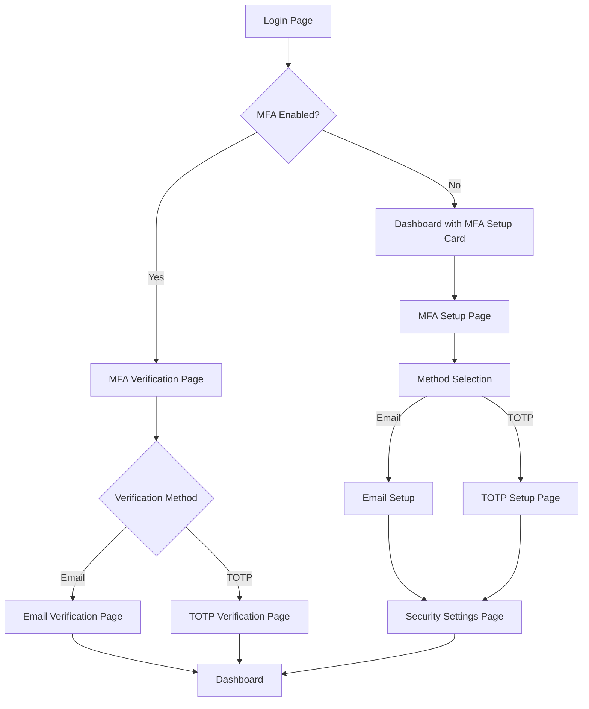

# Multi-Factor Authentication (MFA) System - Product Requirements Document

## 1. Product Overview

A comprehensive multi-factor authentication system that enhances security through email verification and Time-based One-Time Password (TOTP) methods, providing users with flexible and secure authentication options.

The system addresses critical security vulnerabilities by implementing industry-standard two-factor authentication, protecting user accounts from unauthorized access while maintaining an intuitive user experience.

Target market value: Enhanced security compliance for financial trading platforms and enterprise applications requiring robust authentication mechanisms.

## 2. Core Features

### 2.1 User Roles

| Role | Registration Method | Core Permissions |
|------|---------------------|------------------|
| Standard User | Email registration with MFA setup | Can enable/disable MFA, manage authentication methods |
| Admin User | Invitation-based with mandatory MFA | Can view security logs, manage system-wide MFA policies |

### 2.2 Feature Module

Our MFA system requirements consist of the following main pages:

1. **MFA Setup Page**: Initial configuration wizard, method selection, setup instructions
2. **Email Verification Page**: Code input interface, resend functionality, validation feedback
3. **TOTP Setup Page**: QR code display, secret key backup, authenticator app instructions
4. **MFA Verification Page**: Code input for login, method switching, backup options
5. **Security Settings Page**: MFA management, recovery codes, method preferences
6. **Dashboard Integration**: Suggestion cards, setup prompts, status indicators

### 2.3 Page Details

| Page Name | Module Name | Feature description |
|-----------|-------------|---------------------|
| MFA Setup Page | Setup Wizard | Guide users through initial MFA configuration with step-by-step instructions |
| MFA Setup Page | Method Selection | Allow users to choose between email verification and TOTP authentication |
| Email Verification Page | Code Input | Accept 6-digit verification codes with real-time validation |
| Email Verification Page | Rate Limiting | Implement brute force protection with progressive delays |
| Email Verification Page | Resend Control | Manage code resend requests with cooldown periods |
| TOTP Setup Page | QR Code Generator | Display scannable QR codes compatible with authenticator apps |
| TOTP Setup Page | Secret Display | Show backup secret keys with copy functionality |
| TOTP Setup Page | App Instructions | Provide setup guides for Google Authenticator, Microsoft Authenticator, Authy |
| MFA Verification Page | Code Validation | Verify 6-digit codes with 30-second time windows for TOTP |
| MFA Verification Page | Method Switching | Allow users to switch between available authentication methods |
| MFA Verification Page | Recovery Access | Provide backup code entry for account recovery |
| Security Settings Page | MFA Management | Enable/disable MFA, change preferred methods, view active sessions |
| Security Settings Page | Recovery Codes | Generate, display, and manage backup recovery codes |
| Security Settings Page | Security Logs | Display authentication attempts and security events |
| Dashboard Integration | Suggestion Cards | Show contextual prompts for MFA setup and profile completion |
| Dashboard Integration | Status Indicators | Display current MFA status and security level |

## 3. Core Process

**Standard User Flow:**
1. User logs in with username/password
2. System checks MFA status and redirects to appropriate verification method
3. User completes MFA verification (email code or TOTP)
4. System grants access to authenticated areas
5. User can manage MFA settings in security preferences

**Admin User Flow:**
1. Admin accesses security dashboard with mandatory MFA
2. Views system-wide security logs and user MFA status
3. Configures global MFA policies and requirements
4. Monitors authentication events and security metrics

## 4. User Interface Design

### 4.1 Design Style

- **Primary Colors**: Deep blue (#1e40af) for security elements, green (#059669) for success states
- **Secondary Colors**: Gray (#6b7280) for neutral elements, red (#dc2626) for errors
- **Button Style**: Rounded corners (8px radius) with subtle shadows and hover animations
- **Font**: Inter font family, 14px base size for body text, 18px for headings
- **Layout Style**: Card-based design with clean spacing, centered forms with max-width constraints
- **Icons**: Lucide React icons for consistency, security-themed icons (Shield, Lock, Key)

### 4.2 Page Design Overview

| Page Name | Module Name | UI Elements |
|-----------|-------------|-------------|
| MFA Setup Page | Setup Wizard | Progressive stepper component, method selection cards with icons, clear call-to-action buttons |
| Email Verification Page | Code Input | Large 6-digit input fields, countdown timer, resend button with cooldown state |
| TOTP Setup Page | QR Code Display | Centered QR code with border, secret key with copy button, app download links |
| MFA Verification Page | Code Entry | Focused input field, method switcher tabs, backup code link |
| Security Settings Page | MFA Controls | Toggle switches, status badges, action buttons with confirmation modals |
| Dashboard Integration | Suggestion Cards | Dismissible cards with progress indicators, action buttons, and close icons |

### 4.3 Responsiveness

Mobile-first responsive design with touch-optimized interactions, adaptive layouts for tablet and desktop screens, and accessibility features including screen reader support and keyboard navigation.

## 5. Security Requirements

### 5.1 Email Verification Security
- 6-digit codes with cryptographically secure random generation
- 5-minute default expiration with configurable timeouts
- Rate limiting: 3 attempts per minute, progressive delays for repeated failures
- Secure email delivery with encrypted SMTP connections

### 5.2 TOTP Security
- RFC 6238 compliant implementation with SHA-1 algorithm
- 30-second time windows with 1-step tolerance for clock drift
- AES-256 encryption for secret storage in database
- Recovery codes: 10 single-use codes with secure generation

### 5.3 Session Management
- MFA verification required for sensitive operations
- Session timeout after 24 hours of inactivity
- Device fingerprinting for suspicious login detection
- Comprehensive audit logging for all authentication events

## 6. Dashboard Integration Specifications

### 6.1 Suggestion Cards Logic
- **Profile Completion Card**: Display when user profile fields are <80% complete
- **MFA Setup Card**: Display when no MFA methods are enabled
- **Card Dismissal**: Hide for 7 days after dismissal, reappear if conditions persist
- **Priority Order**: MFA setup (high), profile completion (medium)

### 6.2 Card Behavior
- Smooth slide-in animations on appearance
- Click-to-dismiss with confirmation for important security cards
- Progress indicators showing completion status
- Direct action buttons linking to relevant setup pages