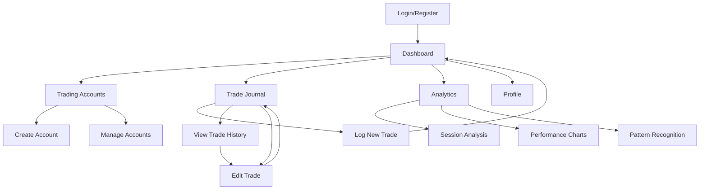

# Trading Journal Web Application - Product Requirements Document

## 1. Product Overview
A comprehensive trading journal web application that enables traders to log, track, and analyze their trading performance with detailed insights and visual analytics.

The platform solves the critical problem of trade tracking and performance analysis by providing traders with a centralized system to record trades, identify patterns, and improve their trading strategies through data-driven insights.

Target market: Individual retail traders, day traders, and swing traders seeking to improve their trading performance through systematic journaling and analysis.

## 2. Core Features

### 2.1 User Roles
| Role | Registration Method | Core Permissions |
|------|---------------------|------------------|
| Trader | Email registration with verification | Full access to personal trading accounts, trade logging, analytics, and dashboard |

### 2.2 Feature Module
Our trading journal application consists of the following main pages:
1. **Authentication pages**: user registration, login, password reset.
2. **Dashboard page**: performance overview, key metrics, recent trades summary.
3. **Trading Accounts page**: account creation, management, deposited amounts tracking.
4. **Trade Journal page**: comprehensive trade logging with all required fields.
5. **Analytics page**: detailed performance analysis, charts, session insights.
6. **Profile page**: user settings, account preferences, data export options.

### 2.3 Page Details
| Page Name | Module Name | Feature description |
|-----------|-------------|---------------------|
| Authentication | Registration | Create account with email verification, secure password requirements |
| Authentication | Login | Secure login with email/password, remember me option, password reset |
| Dashboard | Performance Overview | Display total trades, current P/L status, cumulative PnL with visual indicators |
| Dashboard | Recent Activity | Show latest 5-10 trades with quick status overview |
| Dashboard | Quick Stats | Win/loss ratio, best performing session, monthly performance |
| Trading Accounts | Account Management | Create, edit, delete trading accounts with starting deposit amounts |
| Trading Accounts | Balance Tracking | Track current balance, deposits, withdrawals per account |
| Trade Journal | Trade Entry Form | Comprehensive form with all required fields: Trade name, Account selection, Date, Symbol, News impact, Bias, Session, Entry time, Confluences (multi-select), Entry/Stop/Target prices, P/L status, Mistakes (multi-select) |
| Trade Journal | Trade History | Searchable and filterable list of all trades with sorting options |
| Trade Journal | Trade Details | Detailed view of individual trades with edit/delete capabilities |
| Analytics | Session Analysis | Most profitable sessions, favorite trading sessions with performance metrics |
| Analytics | Performance Charts | Visual charts showing P/L over time, win/loss ratios, session performance |
| Analytics | Pattern Recognition | Identify strengths and weaknesses based on confluences and mistakes data |
| Profile | User Settings | Account preferences, notification settings, data export options |
| Profile | Data Management | Export trades to CSV/PDF, backup and restore functionality |

## 3. Core Process

**New User Flow:**
1. User registers with email and password
2. Email verification required
3. User creates first trading account with starting deposit
4. User can begin logging trades

**Daily Trading Flow:**
1. User logs into dashboard to view current performance
2. User navigates to Trade Journal to log new trades
3. User fills comprehensive trade form with all required details
4. User can view and analyze performance in Analytics section
5. User reviews dashboard for daily/weekly performance summary

**Analysis Flow:**
1. User accesses Analytics page for detailed insights
2. User reviews session performance and identifies patterns
3. User examines mistakes and confluences for improvement areas
4. User exports data for external analysis if needed

## 4. User Interface Design

### 4.1 Design Style
- **Primary Colors**: Deep blue (#1e3a8a) and electric blue (#3b82f6) for professional trading aesthetic
- **Secondary Colors**: Green (#10b981) for profits, Red (#ef4444) for losses, Gray (#6b7280) for neutral elements
- **Button Style**: Rounded corners (8px radius) with subtle shadows and hover animations
- **Font**: Inter or Roboto for clean readability, 14px base size, 16px for headings
- **Layout Style**: Card-based design with clean spacing, top navigation with sidebar for main sections
- **Icons**: Lucide React icons for consistency, financial and chart-focused icon set
- **Animation**: Subtle transitions (200ms) for hover states and page transitions

### 4.2 Page Design Overview
| Page Name | Module Name | UI Elements |
|-----------|-------------|-------------|
| Dashboard | Performance Overview | Large metric cards with color-coded P/L indicators, progress bars for goals, mini charts |
| Dashboard | Recent Activity | Clean table with alternating row colors, status badges, quick action buttons |
| Trade Journal | Trade Entry Form | Multi-step form with grouped sections, dropdown selectors, date/time pickers, multi-select chips for confluences/mistakes |
| Trade Journal | Trade History | Data table with advanced filtering, sorting, pagination, search functionality |
| Analytics | Performance Charts | Interactive charts using Chart.js or Recharts, responsive design, hover tooltips |
| Analytics | Session Analysis | Grid layout with session cards, performance indicators, comparison charts |
| Trading Accounts | Account Cards | Card-based layout showing account name, balance, P/L with visual indicators |
| Profile | Settings Form | Clean form layout with sections, toggle switches, file upload for avatar |

### 4.3 Responsiveness
Desktop-first design with mobile-adaptive breakpoints at 768px and 1024px. Touch-optimized interactions for mobile devices including larger tap targets, swipe gestures for navigation, and collapsible sidebar menu. Charts and tables will stack vertically on mobile with horizontal scrolling where necessary.