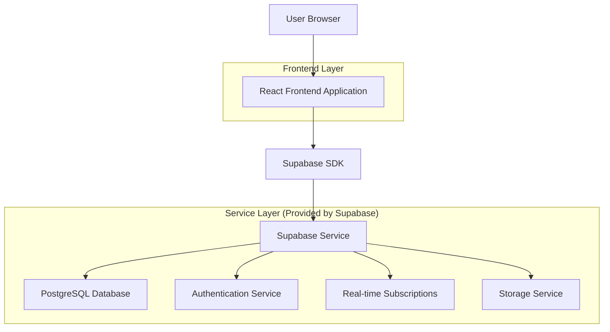
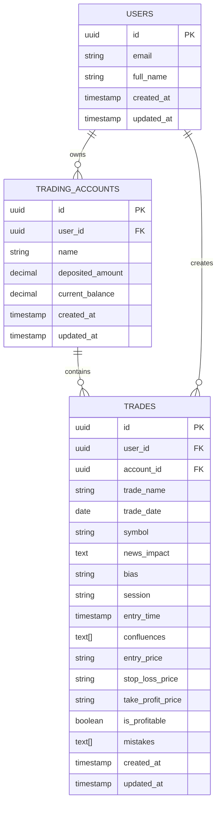

# Trading Journal Web Application - Technical Architecture Document

## 1. Architecture Design



## 2. Technology Description

* Frontend: React\@18 + TypeScript\@5 + Tailwind CSS\@3 + Vite\@5

* Backend: Supabase (PostgreSQL + Auth + Real-time)

* Charts: Recharts\@2 for data visualization

* UI Components: Headless UI + Heroicons

* Form Handling: React Hook Form + Zod validation

* State Management: Zustand for client state

* Date Handling: date-fns for date manipulation

## 3. Route Definitions

| Route        | Purpose                                  |
| ------------ | ---------------------------------------- |
| /            | Landing page with authentication         |
| /login       | User login page                          |
| /register    | User registration page                   |
| /dashboard   | Main dashboard with performance overview |
| /accounts    | Trading accounts management              |
| /journal     | Trade logging and history                |
| /journal/new | New trade entry form                     |
| /journal/:id | Individual trade details and editing     |
| /analytics   | Performance analytics and insights       |
| /profile     | User profile and settings                |

## 4. API Definitions

### 4.1 Core API

**Authentication (Handled by Supabase Auth)**

```typescript
// Sign up
supabase.auth.signUp({
  email: string,
  password: string
})

// Sign in
supabase.auth.signInWithPassword({
  email: string,
  password: string
})

// Sign out
supabase.auth.signOut()
```

**Trading Accounts API**

```typescript
// Get user accounts
GET /rest/v1/trading_accounts?user_id=eq.{userId}

// Create account
POST /rest/v1/trading_accounts
Body: {
  name: string,
  deposited_amount: number,
  current_balance: number,
  user_id: string
}

// Update account
PATCH /rest/v1/trading_accounts?id=eq.{accountId}
Body: {
  name?: string,
  deposited_amount?: number,
  current_balance?: number
}
```

**Trades API**

```typescript
// Get user trades
GET /rest/v1/trades?account_id=in.(account_ids)

// Create trade
POST /rest/v1/trades
Body: {
  trade_name: string,
  account_id: string,
  date: string,
  symbol: string,
  news_impact: string,
  bias: string,
  session: string,
  entry_time: string,
  confluences: string[],
  entry_price: string,
  stop_loss_price: string,
  take_profit_price: string,
  is_profitable: boolean,
  mistakes: string[]
}

// Update trade
PATCH /rest/v1/trades?id=eq.{tradeId}
Body: { /* same fields as create */ }

// Delete trade
DELETE /rest/v1/trades?id=eq.{tradeId}
```

## 5. Data Model

### 5.1 Data Model Definition



### 5.2 Data Definition Language

**Users Table (handled by Supabase Auth)**

```sql
-- Users table is automatically created by Supabase Auth
-- We'll extend it with a profiles table for additional user data
CREATE TABLE profiles (
  id UUID REFERENCES auth.users(id) PRIMARY KEY,
  full_name TEXT,
  avatar_url TEXT,
  created_at TIMESTAMP WITH TIME ZONE DEFAULT NOW(),
  updated_at TIMESTAMP WITH TIME ZONE DEFAULT NOW()
);

-- Enable RLS
ALTER TABLE profiles ENABLE ROW LEVEL SECURITY;

-- Policies
CREATE POLICY "Users can view own profile" ON profiles
  FOR SELECT USING (auth.uid() = id);

CREATE POLICY "Users can update own profile" ON profiles
  FOR UPDATE USING (auth.uid() = id);

CREATE POLICY "Users can insert own profile" ON profiles
  FOR INSERT WITH CHECK (auth.uid() = id);

-- Grants
GRANT SELECT ON profiles TO anon;
GRANT ALL PRIVILEGES ON profiles TO authenticated;
```

**Trading Accounts Table**

```sql
CREATE TABLE trading_accounts (
  id UUID PRIMARY KEY DEFAULT gen_random_uuid(),
  user_id UUID REFERENCES auth.users(id) ON DELETE CASCADE NOT NULL,
  name VARCHAR(100) NOT NULL,
  deposited_amount DECIMAL(15,2) NOT NULL DEFAULT 0,
  current_balance DECIMAL(15,2) NOT NULL DEFAULT 0,
  created_at TIMESTAMP WITH TIME ZONE DEFAULT NOW(),
  updated_at TIMESTAMP WITH TIME ZONE DEFAULT NOW()
);

-- Enable RLS
ALTER TABLE trading_accounts ENABLE ROW LEVEL SECURITY;

-- Policies
CREATE POLICY "Users can view own accounts" ON trading_accounts
  FOR SELECT USING (auth.uid() = user_id);

CREATE POLICY "Users can create own accounts" ON trading_accounts
  FOR INSERT WITH CHECK (auth.uid() = user_id);

CREATE POLICY "Users can update own accounts" ON trading_accounts
  FOR UPDATE USING (auth.uid() = user_id);

CREATE POLICY "Users can delete own accounts" ON trading_accounts
  FOR DELETE USING (auth.uid() = user_id);

-- Indexes
CREATE INDEX idx_trading_accounts_user_id ON trading_accounts(user_id);
CREATE INDEX idx_trading_accounts_created_at ON trading_accounts(created_at DESC);

-- Grants
GRANT SELECT ON trading_accounts TO anon;
GRANT ALL PRIVILEGES ON trading_accounts TO authenticated;
```

**Trades Table**

```sql
CREATE TABLE trades (
  id UUID PRIMARY KEY DEFAULT gen_random_uuid(),
  user_id UUID REFERENCES auth.users(id) ON DELETE CASCADE NOT NULL,
  account_id UUID REFERENCES trading_accounts(id) ON DELETE CASCADE NOT NULL,
  trade_name VARCHAR(200) NOT NULL,
  trade_date DATE NOT NULL,
  symbol VARCHAR(20) NOT NULL,
  news_impact TEXT,
  bias VARCHAR(50),
  session VARCHAR(50),
  entry_time TIMESTAMP WITH TIME ZONE,
  confluences TEXT[] DEFAULT '{}',
  entry_price VARCHAR(20),
  stop_loss_price VARCHAR(20),
  take_profit_price VARCHAR(20),
  is_profitable BOOLEAN NOT NULL DEFAULT false,
  mistakes TEXT[] DEFAULT '{}',
  created_at TIMESTAMP WITH TIME ZONE DEFAULT NOW(),
  updated_at TIMESTAMP WITH TIME ZONE DEFAULT NOW()
);

-- Enable RLS
ALTER TABLE trades ENABLE ROW LEVEL SECURITY;

-- Policies
CREATE POLICY "Users can view own trades" ON trades
  FOR SELECT USING (auth.uid() = user_id);

CREATE POLICY "Users can create own trades" ON trades
  FOR INSERT WITH CHECK (auth.uid() = user_id);

CREATE POLICY "Users can update own trades" ON trades
  FOR UPDATE USING (auth.uid() = user_id);

CREATE POLICY "Users can delete own trades" ON trades
  FOR DELETE USING (auth.uid() = user_id);

-- Indexes
CREATE INDEX idx_trades_user_id ON trades(user_id);
CREATE INDEX idx_trades_account_id ON trades(account_id);
CREATE INDEX idx_trades_date ON trades(trade_date DESC);
CREATE INDEX idx_trades_symbol ON trades(symbol);
CREATE INDEX idx_trades_session ON trades(session);
CREATE INDEX idx_trades_profitable ON trades(is_profitable);

-- Grants
GRANT SELECT ON trades TO anon;
GRANT ALL PRIVILEGES ON trades TO authenticated;
```

**Predefined Options Tables**

```sql
-- Confluences options
CREATE TABLE confluence_options (
  id UUID PRIMARY KEY DEFAULT gen_random_uuid(),
  name VARCHAR(100) NOT NULL UNIQUE,
  description TEXT,
  created_at TIMESTAMP WITH TIME ZONE DEFAULT NOW()
);

-- Mistakes options
CREATE TABLE mistake_options (
  id UUID PRIMARY KEY DEFAULT gen_random_uuid(),
  name VARCHAR(100) NOT NULL UNIQUE,
  description TEXT,
  created_at TIMESTAMP WITH TIME ZONE DEFAULT NOW()
);

-- Enable RLS for both tables
ALTER TABLE confluence_options ENABLE ROW LEVEL SECURITY;
ALTER TABLE mistake_options ENABLE ROW LEVEL SECURITY;

-- Public read access
CREATE POLICY "Anyone can read confluence options" ON confluence_options
  FOR SELECT TO public USING (true);

CREATE POLICY "Anyone can read mistake options" ON mistake_options
  FOR SELECT TO public USING (true);

-- Grants
GRANT SELECT ON confluence_options TO anon, authenticated;
GRANT SELECT ON mistake_options TO anon, authenticated;

-- Insert default confluence options
INSERT INTO confluence_options (name, description) VALUES
('Support/Resistance', 'Price level acting as support or resistance'),
('Trend Line', 'Price respecting trend line'),
('Moving Average', 'Price interaction with moving averages'),
('Volume', 'High volume confirmation'),
('Candlestick Pattern', 'Reversal or continuation patterns'),
('Fibonacci', 'Fibonacci retracement/extension levels'),
('RSI Divergence', 'RSI showing divergence with price'),
('MACD Signal', 'MACD crossover or divergence'),
('News Event', 'Fundamental news driving price'),
('Market Structure', 'Break of structure or order flow');

-- Insert default mistake options
INSERT INTO mistake_options (name, description) VALUES
('FOMO Entry', 'Fear of missing out led to poor entry'),
('No Stop Loss', 'Entered trade without proper stop loss'),
('Revenge Trading', 'Trading to recover losses emotionally'),
('Overleveraged', 'Position size too large for account'),
('Ignored Plan', 'Deviated from predetermined trading plan'),
('Poor Risk Management', 'Risk/reward ratio not favorable'),
('Emotional Decision', 'Let emotions drive trading decision'),
('No Confluence', 'Entered without multiple confirmations'),
('Wrong Timing', 'Good setup but poor timing'),
('Overtrading', 'Too many trades in short period');
```

**Update Triggers**

```sql
-- Function to update updated_at timestamp
CREATE OR REPLACE FUNCTION update_updated_at_column()
RETURNS TRIGGER AS $$
BEGIN
  NEW.updated_at = NOW();
  RETURN NEW;
END;
$$ language 'plpgsql';

-- Apply triggers to all tables
CREATE TRIGGER update_profiles_updated_at BEFORE UPDATE ON profiles
  FOR EACH ROW EXECUTE FUNCTION update_updated_at_column();

CREATE TRIGGER update_trading_accounts_updated_at BEFORE UPDATE ON trading_accounts
  FOR EACH ROW EXECUTE FUNCTION update_updated_at_column();

CREATE TRIGGER update_trades_updated_at BEFORE UPDATE ON trades
  FOR EACH ROW EXECUTE FUNCTION update_updated_at_column();
```

